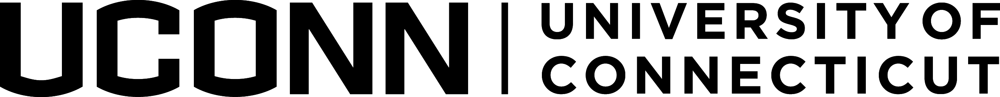

# Course Syllabus

**{{ COURSE_CODE }} {{ SECTION }}**

**{{ TITLE }} ({{ CREDITS }})**

**{{ TERM }}**

**{{ ROOM }} - {{ MEETING_TIMES }}**

---
## Course Instructor

**Name:** {{ INSTRUCTOR }}

**Office:** {{ OFFICE }}

**Email:** {{ EMAIL }}

For information on how to contact your course instructor, including office hours, see the {{ '[course website]({link})'.format(link=COURSE_LINK)}}.

**Mode of Delivery:** Online (All course activities and assessments, including the Final Exam, will be conducted Online.)

## Course Description

# BRIEF OVERVIEW
This class is a hands-on introduction to several kinds of computational models used in the cognitive and neural sciences. In science, computational models are tools we use to test and refine theories. No programming background is required. Students will learn programming basics so that they can work with already-implemented models (and students can choose to do more advanced challenges). The modeling and programming we cover could help prepare students for advanced studies in various disciplines, and/or a foundation for delving more deeply into machine learning or data science. Students should bring a laptop to class each week.


# DETAILED OVERVIEW
What is the purpose of computational models in the cognitive and neural sciences? Theories are principled explanations that make sense of data (observations of behavior or neural function). For example, primacy and recency effects in serial memory motivate a division between long-term memory and short-term memory as well as the idea that rehearsal is a key mechanism for transferring information from short- to long-term memory. Computational models are tools for testing and refining theories by forcing us to make explicit our assumptions about inputs, representations, and/or processes underlying some cognitive domain. Once a theory proposes even a few interacting components, it may be hard to determine the specific predictions that result without creating a model capable of simulating the interactions.

We will explore a variety of modeling approaches, including: mathematical models (equations that correctly capture aspects of data patterns), agent-based models (where we simulate interactions among many ‘individuals’ following similar rules or algorithms), network science models (which can characterize local and global aspects of connected systems, from neurons to friendships, and interactions among elements), and neural network models (dynamic networks of artificial neurons that can be trained to simulate cognitive processes). We will apply models to a variety of theories in domains such as learning and memory, vision, and language. We will explore ways to analyze models and link them to theories, behavior, and neural activity. We will also examine the implications of necessary simplifying assumptions, as well as common pitfalls and mistakes to avoid.

# COURSE OBJECTIVES
By the end of the course, students will be able to:
- Describe the role of theories in the scientific method generally, via deeper   understanding of how theories are developed in the cognitive and neural sciences
- Describe how computational models can be used as theory-refining tools
- Distinguish between theoretical models and application models, as well as predictive and explanatory models
- Link biological data (behavior in particular) to models
- Determine whether the relation between a model and biological data suggests whether the model is falsified, the model needs to be refined, or the model is consistent with available data
- Use Jupyter notebooks to conduct and analyze simulations with a variety of computational models (note that you will not be graded directly on programming, but you will have the opportunity to develop basic programming skills if you choose to do so)

# GRADING AND ATTENDANCE
Attendance will not be graded, but students are advised to attend every class. Significant content will be covered in class, along with hands-on guidance to using the Jupyter notebooks that will be provided and active discussion. A small portion of the grade is also based on active participation. The instructor will not conduct makeup sessions for individuals who miss class sessions.

# Grades will be based on:
- 64%: 4 brief lab reports (one per framework, summarizing the purpose of each model and assessing their success / utility), each worth 16% of the grade. Each lab report will have a 'default' scope and a 'challenge' scope. Honors students and graduate students will be assigned the challenge versions, while other students can choose the challenge versions to earn modest extra credit (up to 2% per report).
- 10%: 10 in-class quizzes (1% each) designed to reinforce key concepts
  6%: Midterm exam -- short written exam
- 12%: Final exam -- take-home essay exam due during finals week
  8%: Participation -- based on whether you contribute to discussions / answer instructor questions at least once every two sessions on average (to be sure everyone has opportunities to contribute, the instructor will call on each student occasionally)

## Course Format

This course has {{ FORMAT }}

You will find all the important term dates in the [UBCO Academic Calendar](http://www.calendar.ubc.ca/okanagan/index.cfm?go=deadlines).

## Learning Outcomes

The Learning Outcomes for this course are:

```{include} syllabus_bits/course_LOs.md
```

More details about the course can be found on the {{ '[course website]({link})'.format(link=CANVAS_LINK.replace('CANVAS_ID',CANVAS_ID))}}.

## Required Materials

There is no requirement to purchase textbooks or any other materials for this course.
Resources and materials for this course can be found on the {{ '[course website]({link})'.format(link=CANVAS_LINK.replace('CANVAS_ID',CANVAS_ID))}}.

## Course Evaluation

```{include} syllabus_bits/grading_practices_simple.md
```

## Passing Criteria

```{include} syllabus_bits/passing_requirement.md
```

## Late Policy and Missed Assignments and Exams

Deadlines in this course have a generous no-penalty {{ GRACE_PERIOD }} grace period so late submissions are not generally accepted.
Missed Tests and Exams will be given a score of 0 unless prior arrangements are made with the course instructor.
To contact the instructor for this course, use {{ FORUM_LINK }}.
Details on deadlines and other course policies can be found on the {{ '[course website]({link})'.format(link=CANVAS_LINK.replace('CANVAS_ID',CANVAS_ID))}}.

## Tentative Course Schedule
The tentative course schedule, subject to change, can be found on the {{ '[course website]({link})'.format(link=CANVAS_LINK.replace('CANVAS_ID',CANVAS_ID))}}.

```{include} syllabus_bits/schedule.md
```

```{include} syllabus_bits/policies.md
```
